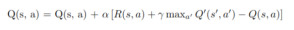

## Reinforcement Learning
Reinforcement Learning deals with an agent (an AI) which  learns from the environment by interacting with it (through trial and error) and receiving rewards (negative or positive) as feedback for performing actions.

#### Example : Learning to ride a Bicycle

<b>Agent</b>: The agent is the person learning to ride the cycle.

<b>Environment</b>: The environment includes the cycle, the ground, obstacles, and everything around the learner. It also involves the forces acting on the bike (like balance, speed,  etc.) . Environment can be encoded into states. For example a state may be `(Angle with ground = 85 degrees, speed = 20, obstacle ahead = None, etc..  )`

<b>Actions</b>: The possible actions the agent can take include pedaling, steering left or right, leaning forward or backward, applying brakes and so on.

<b>Rewards</b>:
    Positive feedback (rewards) could be successfully balancing and riding the cycle without falling or moving in the desired direction.
    Negative feedback (penalties) could be falling off, losing balance, or crashing.

<b>Learning Process</b>:
    Trial and error: The learner tries different actions (e.g., pedaling faster, turning the handlebars, etc.) and receives feedback (either a reward or penalty) based on how well they are performing.
    For instance, when the learner pedals slowly and falls, they learn that pedaling faster is more effective for balance, even if it involves occasional instability.
    Over time, the learner builds a strategy where they know what actions lead to better results (e.g., balancing better by adjusting the angle of the handlebars when turning).

## Q-Learning
Q-Learning is the simplest form of reinforcement learning where the Agent needs to have memory for what actions are preferrable in given states. It needs to encounter every state that could occur and what would be the outcome if a certain action is done in that state. Doing so, the agent observing its environment will perform preferrable actions

Q-Learning is a  algorithm that learns a mapping from all `(state, action)` pairs to their corresponding Q-values. The Q-value for a pair represents the expected cumulative reward for taking that action in the given state and following the optimal policy thereafter.

## Working
<b>Q-value Mapping</b>: The algorithm essentially builds and updates a table of Q-values for each **(state, action)** pair.

<table>
  <thead>
    <tr>
      <th>State-Action Pair</th>
      <th>Q-value</th>
    </tr>
  </thead>
  <tbody>
    <tr>
      <td>(s1, a1)</td>
      <td>0.00</td>
    </tr>
    <tr>
      <td>(s1, a2)</td>
      <td>0.00</td>
    </tr>
    <tr>
      <td>(s2, a1)</td>
      <td>0.50</td>
    </tr>
    <tr>
      <td>(s2, a2)</td>
      <td>1.00</td>
    </tr>
    <tr>
      <td>(s3, a1)</td>
      <td>-1.00</td>
    </tr>
  </tbody>
</table>

<strong>For example:</strong>

<table>
  <thead>
    <tr>
      <th>State</th>
      <th>Action</th>
      <th>Q-value</th>
    </tr>
  </thead>
  <tbody>
    <tr>
      <td>(1, 3, 2, 1)</td>
      <td>(0, 1)</td>
      <td>0.00</td>
    </tr>
    <tr>
      <td>(1, 3, 2, 1)</td>
      <td>(1, 2)</td>
      <td>0.00</td>
    </tr>
    <tr>
      <td>(0, 1, 2, 0)</td>
      <td>(2, 1)</td>
      <td>0.50</td>
    </tr>
    <tr>
      <td>(0, 1, 2, 0)</td>
      <td>(2, 2)</td>
      <td>1.00</td>
    </tr>
    <tr>
      <td>(1, 3, 0, 0)</td>
      <td>(0, 1)</td>
      <td>-1.00</td>
    </tr>
  </tbody>
</table>

- Initially most Q-values are 0 . When 2 AIs play the game and game ends,some final states are updated with the reward
- In the next iteration of training , these rewards are used to update Q_values for second-to-last steps by considering the future rewards 
- In similar fashion , the information of reward is propagated to the  to all (state,action) pairs

<b>Advantage : </b>Easy to implement as many problems can be defined in a (state,space) framework 
<b>Disadvantage : </b>Q-Learning becomes infeasible when the number of states and actions is large.

<b> Updates to the Q-values is done iteratively using the formula: </b>

`Q(s, a) <- Q(s, a) + alpha * (new value estimate - old value estimate)` 

<b>
- The equation in the image is more general and allows giving intermediate rewards at each step and weigh the importance of future rewards

- The new value estimate is the sum of immediate reward for (taking `a` action in state `s`) +  expected future rewards.
- `s'` represents new state after taking the current action `a`.
- `a'` represents a possible actions in the new state `s'`
- `$\max_{a'} Q'(s', a')$` means for all actions  `a'` possible in state `s'`, We would choose the action that maximizes the Q value.
- `γ` is the discount factor, weighing the importance of future rewards.
</b>

<b> Over time, the Q-values converge to their true values if the algorithm explores all possible **(state, action)** pairs sufficiently.</b>

### Why intermediate moves still get meaningful updates
<b> 
- Reward at the end propagates backward: At the end of the game, a reward (+ 1 for the winner and − 1 for the loser) is assigned to the final move. This updates the Q-value for that final state-action pair. When updating the Q-value for the second-to-last move, the algorithm takes into account the Q-value of the new state ( max ⁡ 𝑎 𝑄 ( 𝑠 ′ , 𝑎 ) max a ​ Q(s ′ ,a)), which was just updated. This way, the reward at the end of the game propagates backward through the sequence of moves. 

- In each intermediate step, the Q-value for a move is updated based on the maximum Q-value of the next state. Over time, as the AI plays more games, the Q-values for earlier moves are refined because the values of future states become more accurate.
</b>
